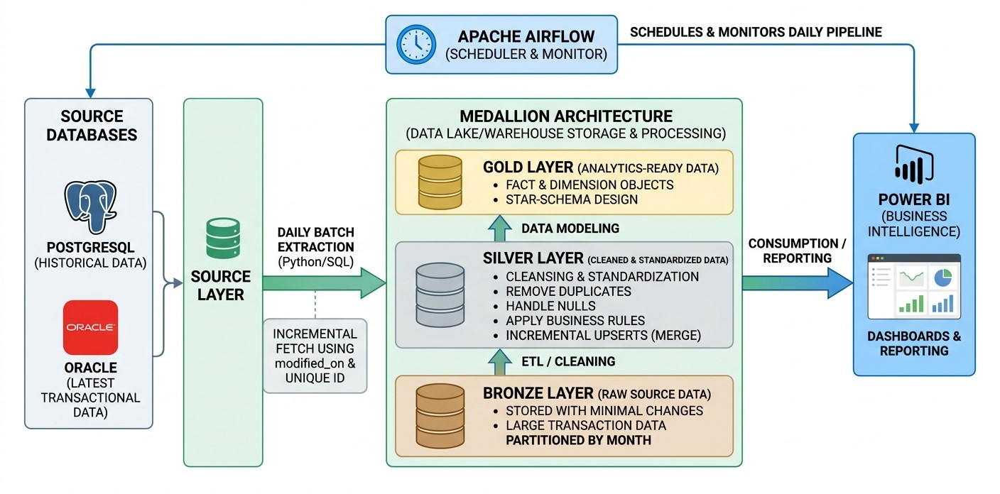
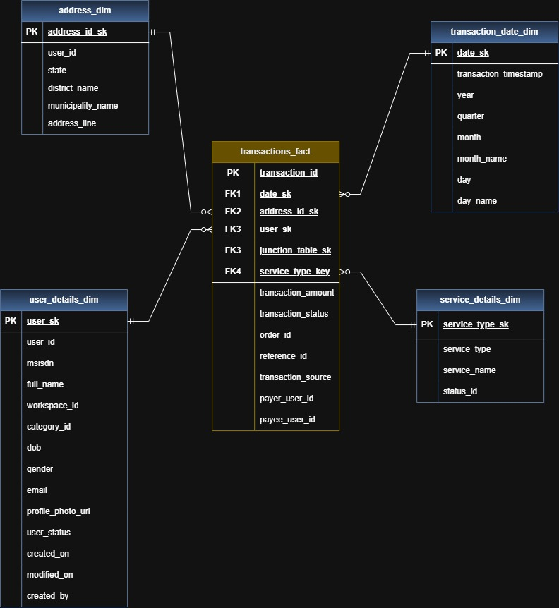

# Digital Payment ETL Pipeline

A batch ETL pipeline for preparing digital wallet transaction data for analytics and Power BI reporting. The solution uses **Python, Apache Airflow, SQL, PostgreSQL, and Oracle Database**.

## Business Goal

The pipeline creates a clean analytical database without placing heavy reporting workloads on the production transaction system. It supports analysis of:

- Transaction volume and amount by month, quarter, service, and workspace
- Active users and customer segments
- NCELL and NTC registered users
- User-initiated and system-initiated transactions
- Geographic and service-level performance and more

## Data Architecture
<figure>
  
  <figcaption>Fig. 1 — Data Architecture.</figcaption>
</figure>

### Architecture Explanation

1. **Source Databases**  
   PostgreSQL provides historical data, while Oracle provides the latest transactional data. Both databases are shown as one logical source layer.

2. **Apache Airflow and Python ETL**  
   Airflow schedules and monitors the daily pipeline. Python and SQL extract data in batches and track the latest processed record using `modified_on` and a unique record ID.

3. **Bronze Layer**  
   Stores source data with minimal changes. Large transaction data is organized by month for easier processing.

4. **Silver Layer**  
   Cleans and standardizes the data, handles null values, removes duplicates, applies business rules, and performs incremental upserts.

5. **Gold Layer**  
   Provides analytics-ready fact and dimension objects using a star-schema design. Power BI reads from this layer for dashboards and reporting.

## Incremental Loading and Recovery

- The pipeline runs daily at **12:00 AM Nepal Standard Time**.
- Data is processed in batches of **5,000 rows**.
- A composite watermark based on `modified_on` and a unique record ID prevents missed records when timestamps are identical.
- Audit records store the last successful batch, allowing a failed job to restart without reprocessing the full dataset.
- User, service, and address data are loaded before transaction data.

## Data Layers

| Layer | Purpose |
|---|---|
| Bronze | Raw, source-aligned data used for traceability and reprocessing |
| Silver | Cleaned, standardized, deduplicated, and validated data |
| Gold | Analytics-ready transaction facts and dimension views for Power BI |

## Gold Layer ER-Digram

The Gold layer uses `transactions_fact` as the central fact table. The fact table connects to user, address, service, and transaction-date dimensions through surrogate keys.

<figure>
  
  <figcaption>Fig. 1 — Gold Layer Data Model.</figcaption>
</figure>

## Performance Design

- PostgreSQL is preferred for historical extraction to reduce load on Oracle.
- Incremental extraction avoids repeated full-table scans.
- Transaction data is partitioned by month.
- Primary keys and frequently used filter columns are indexed where appropriate.
- The Gold layer contains only reporting-relevant columns.

## Technology Stack

- **Orchestration:** Apache Airflow
- **ETL:** Python and SQL
- **Sources:** PostgreSQL and Oracle Database
- **Analytical Warehouse:** PostgreSQL
- **Reporting:** Power BI
- **Modeling:** Medallion architecture and Kimball star schema
